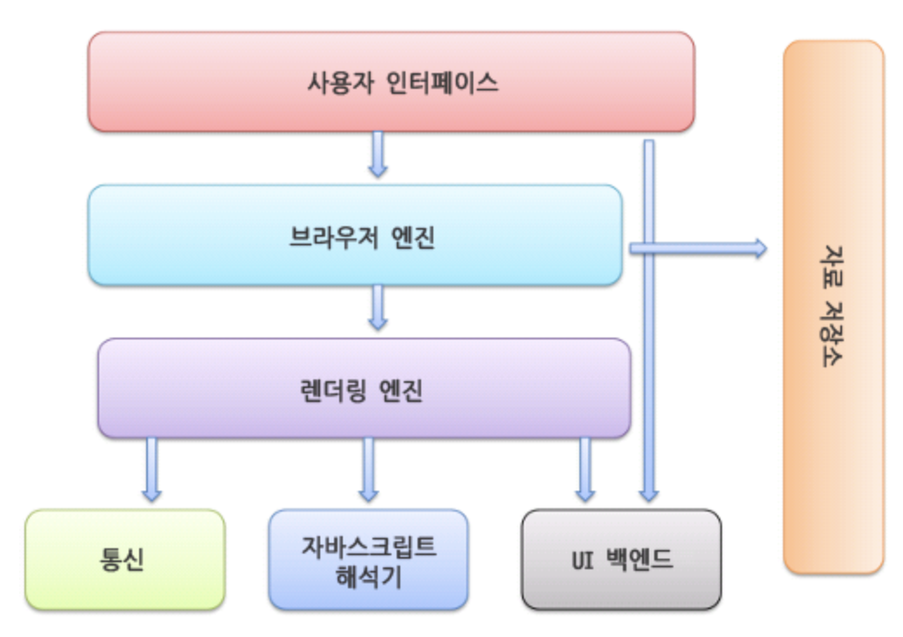
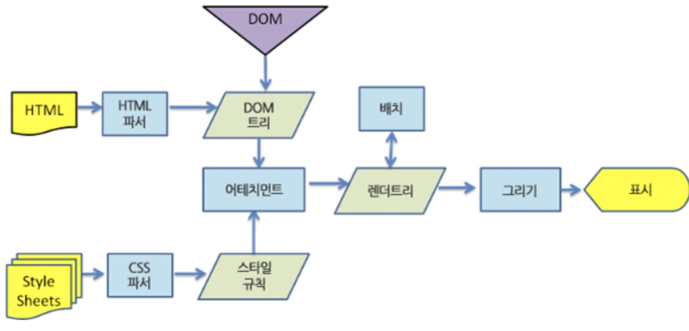
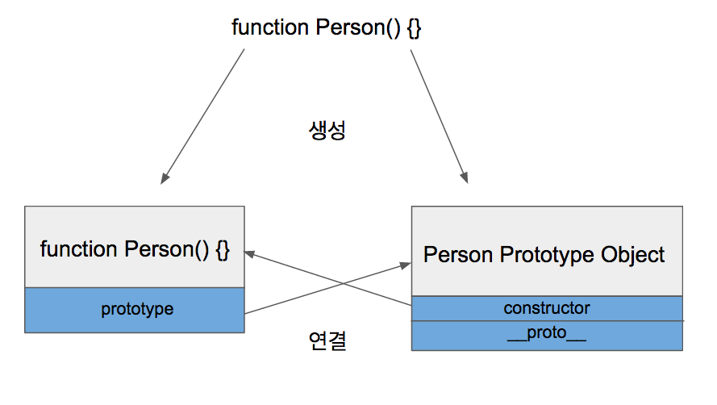

https://github.com/gyeol1212/interview
<h1>브라우저</h1>

사용자가 서버에 요청한 자원을 표시하는 것
(HTMl, PDF, 이미지 등..)

HTML, CSS 명세(by W3C)에 따라 HTML 파일 해석, 표시

1. 사용자 인터페이스
* 페이지를 보여주는 창 외의 부분
2. 브라우저 엔진
* 사용자 인터페이스와 렌더링 엔진 사이의 동작 제어
3. 렌더링 엔진
* 요청한 콘텐츠 표시
* HTML, CSS를 파싱하여 화면에 표시
4. 통신
* 네트워크 호출
5. UI 벡엔드
* 기본적인 장치(ex) 콤보 박스)
* OS 사용자 인터페이스 체계 사용
6. 자바스크립트 해석기
* 자바스크립트 코드를 해석 및 실행
7. 자료 저장소
* 웹 데이터 베이스(HTML5 명세)
* ex) 쿠키

크롬 -> 탭마다 별도의 렌더링 엔진 => 독립된 프로세서



<h2>렌더링 엔진</h2>

요청 받은 내용을 브라우저 화면에 표시하는 일
HTML, XML, 이미지등

* 파이어폭스 -> 게코(Gecko by 모질라)

* 사파리, 크롬 -> 웹킷(Webkit)


1. HTML 문서 파싱 -> 태그를 DOM 노드로 변환(DOM 트리 구축)
2. 스타일 요소 파싱 -> 스타일 규칙(CSSOM)
3. DOM트리 + 스타일 규칙 -> 렌더 트리 구축
4. 렌더 트리 배치
* 각 노드가 화면의 정확한 위치에 표시
5. 렌더 트리 그리기
* UI 백엔드에서 렌더 트리의 각 노드를 그리기

한번에 배치, 그리기가 아니라 나머지 내용을 기다리는 동시에 일부를 먼저 화면에 표시



DOM
* 문서 객체 모델(Document Object 
Model)
* HTML 문서의 객체 표현
* DOM 트리의 최상위 객체는 문서
* 웹페이지를 자바스크립트로 제어하기 위한 객체 모델

BOM
* 브라우저 객체 모델
* 브라우저와 관련된 객체들의 집합
* 최상위 객체는 window
* DOM은 BOM의 하나, window의 하위 객체

렌더러와 DOM 트리는 1:1 관계는 아니다
* head 같은 DOM 요소
* display=none

https://d2.naver.com/helloworld/59361

<h1>객체 지향 프로그래밍</h1>

* 프로그래밍에서 필요한 데이터를 추상화시켜 상태와 행위를 가진 객체를 만들고, 객체들 간의 상호작용을 통해 로직을 구성하는 프로그래밍 방법

* 인간 중심적 프로그래밍 패러다임

<h3>장점</h3>

1. 코드 재사용 용이
* 다른 사람이 만든 클래스를 사용할 수 있고, 상속을 통해 확장 사용 가능
2. 유지 보수 쉬움
* 클래스만 수정하면 됨
3. 대형 프로젝트에 적합
* 클래스 단위로 모듈화 -> 업무 분담

<h3>단점</h3>

1. 처리 속도가 상대적으로 느리다
2. 객체가 많으면 용량이 커짐
3. 설계에 많은 시간과 노력
<h4>키워드</h4>

추상화
* 불필요한 정보는 숨기고 중요한 정보만을 표현함으로써 공통의 속성과 기능을 묶어 이름 붙이는 것

클래스
* 추상화를 거쳐 어떤 집단의 속성과 행위를 변수와 메서드로 정의한 것

인스턴스
* 클래슬에서 정의한 것을 토대로 실제로 메모리에 할당 시킨 것(실제 프로그래밍에 사용되는 데이터)

캡슐화
* 코드를 재수정 없이 재활용하는 것

* 캡슐화를 통해 관련된 기능과 특성을 한곳에 모으고 분류하기 때문에 재활용이 원활
* 클래스 -> 캡슐

다형성
* 하나의 변수명, 함수명 등이 상황에 따라 다른 의미로 해석 가능함.

오버라이딩
* 부모 클래스의 변수, 메서드를 재정의 하는 것.(JS에서는 매개변수, 리턴값 등의 자유도가 높음)

오버로딩
* 같은 이름의 함수를 여러개 정의하고 매개 변수와 타입을 다르게 하여 매개 변수에 따라 다르게 호출할 수 있게 하는 것. (JS에서는 없는 개념. 함수 내에서 케이스 처리를 통해 구현)

Getter, Setter
* OOP에서 객체가 가진 프로퍼티 값을 바깥에서 읽거나 쓸 수 있도록 제공하는 메서드
* 접근자 프로퍼티(외부에서는 프로퍼티로 보이지만 본질은 함수)

<h1>함수형 프로그래밍</h1>

입력과 출력이 통제된 순수 함수 위주로 프로그래밍 하는 것

자료 처리를 수학적 함수의 계산으로 취급하고 상태와 가변 데이터를 멀리하는 프로그래밍 패러다임

입출력이 순수해야 한다.

* 반드시 하나 이상의 인자를 받고, 받은 인자를 처리하여 결과물을 돌려줘야 한다. 
* 함수의 출력값은 함수의 인수에만 의존
* 인자를 제외한 다른 변수는 사용하면 안됨.

Side Effect가 없어야 한다.
* 프로그래머가 바꾸고자 하는 변수 외에는 바뀌어서는 안된다. 원본 데이터는 불변해야한다.

immutable
* 한번 정해진 값은 바뀌지 않는다
* 값이 변경될 경우, 새로운 객체를 생성하고 변경된 값을 주입하여 반환해야 한다. 

합성 함수
* 둘 이상의 함수를 조합하여 만들어진 함수. 
* 여러 작은 순수 함수들로 이루어져있기 때문에, 함수들을 연쇄적 또는 병렬적으로 호출하여 더 큰 함수를 만드는 과정

일급 객체(first class citizen)
* 변수나 데이터 구조안에 함수를 담을 수 있어서 함수의 파라미터로 전달할 수 있고, 함수의 반환값으로 사용할 수 있다.
* 할당에 사용된 이름과 관계없이 고유한 구별이 가능하다.
* 함수를 리터럴로 바로 정의할 수 있다.

<h1>반응형 프로그래밍</h1>
= 선언형 프로그래밍

* 명령형 프로그래밍의 반대말
* 함수형 프로그래밍 활용

모든 것을 스트림(stream)으로 본다
* 스트림 -> 값들의 집합
* 함수형 메서드를 통해 데이터를 immutable하게 관리할 수 있다.

<h1>RESTful</h1>
Resource 들을 하나의 Endpoint에 연결해두고, 각 Endpoint는 그 Resource와 관련된 내용만 관리하는 방법론

자원이 중심에 있고 HTTP Method를 통해 자원을 처리하도록 설계

리소스(자원)은 URI로 표현, 명사로 표현

행위는 HTTP Method로 표현

REST
* representational state transfer

장점
1. 사용하기 쉽다
* 메시지가 의도하는 바를 명확하게 파악하게 쉽다
2. HTTP 인프라를 그대로 사용
* 다양한 플랫폼에서 사용가능
* OPEN API에 적합

단점
1. 메소드 형태가 제한적
2. 표준이 존재하지 않는다.

<h1>GraphQL</h1>
Graph Query Language

server API를 통해 정보를 주고받기 위해 사용하는 Query Language

* 주로 하나의 endpoint 사용
* 요청할 때 사용한 Query 문에 따라 응답의 구조가 달라짐
* 사용자가 응답의 구조를 자신이 원하는 방식으로 바꿀 수 있음

장점
1. HTTP 요청의 횟수를 줄일 수 있다
* 원하는 정보를 하나의 Query 에 담아서 요청할 수 있음
2. 응답의 Size를 줄일 수 있음
* 필요한 부분적으로 요청 가능

단점
1. 요청의 크기가 커질 수 있음
2. 사용자의 악의적인 요청으로 인한 문제 발생 가능

<h1>RESTful vs GraphQL</h1>
1. RESTful

* 파일 전송 등 단순한 Text로 처리되지 않는 요청이 있을 때
* 요청의 구조가 단순하고 정해져 있을 때

2.GraphQL
* 서로 다른 모양의 다양한 요청에 대해 응답할 수 있어야 할 때
* 대부분의 요청이 CRUD에 해당할 때 ??

<h1>CORS</h1>
Cross-Origin-Resource Sharing

* 추가적인 HTTP header를 사용하여 어플리케이션이 다른 origin의 리소스에 접근할 수 있도록 하는 메커니즘

SOP(Same Origin Policy)
* 어떤 출처에서 불러온 문서나 스크립트가 다른 출처에서 가져온 리소스와 상호작용 하는 것을 제한
* 브라우저의 기본 보안 정책

일반적으로 서버 사이드에서 핸들링
클라이언트에서는 http 프록시 설정

<h1>PWA(Progressive Web App)</h1>

* 웹과 앱의 장점을 결합한 웹앱
* 지원하는 웹 브라우저를 통해 설치 없이 접속할 수 있고, 바탕화면에 앱 아이콘을 추가할 수 있고, 푸시 알림 또한 가능함.

<h1>자바스크립트 동작 원리</h1>
자바스크립트 엔진

* 자바스크립트 코드를 실행하는 프로그램 또는 인터프리터
* 렌더링 엔진과는 다르다

웹 브라우저에서 사용

스파이더몽키 -> 최초의 자바스크립트 엔진

V8 -> Chrome, Node.js에서 사용

1. Memory Heap
* 메모리 할당이 일어나는 곳
2. Call Stack
* 코드 실행에 따라 호출 스택이 쌓이는 곳

Web API
* 브라우저에서(javascript x) 제공하는 API
* ex) DOM, setTimeout

Call Stack(호출 스택)
* 자바스크립트는 기본적으로 싱글 쓰레드 기반
* 한번에 한 작업 처리
* 하나의 콜스택 사용
* 요청이 들어올 때마다 순차적으로 콜스택에 담아 처리
* 함수의 호출을 기록하는 구조

Heap
* 동적으로 생성된 인스턴스가 할당되는 메모리

Task Queue(Event Queue)
* Taske들을 임시 저장하는 대기 큐
* 비동기로 호출되는 함수들이 enqueue
* Web API영역에 함수들, 이벤트에 의해 실행되는 함수 -> 비동기로 실행 -> Event queue에 들어간다
* 콜스택이 비면 Event Queue에서 dequeue해서 콜스택에 push한다

<h1>자바스크립트 비동기 처리</h1>
특정 코드의 연산이 끝날 때까지 코드의 실행을 멈추지 않고, 다음 코드를 먼저 실행하는 자바스크립트의 특성

콜백
* 특정 로직이 끝났을 경우, 원하는 동작을 실행시킬 수 있음.

Promise
* 자바스크립트 비동기 처리에 사용되는 객체
* 3가지 상태를 가진다
* 콜백 함수의 인자로 resolve, reject 전달

1. Pending(대기) : 비동기 처리 로직이 아직 완료되지 않은 상태
2. Fulfilled(이행) : 비동기 처리가 완료되어 프로미스 결과 값을 반환해준 상태
3. Rejected(실패) : 비동기 처리가 실패하거나 오류가 발생한 상태

에러 처리 방법
1. then()의 두번째 인자로 에러 처리
```
getData().then(success, error);
```
2. catch() 이용
```
getData()
  .then()
  .catch();
```

<h1>async & await</h1>
자바스크립트의 비동기 처리 패턴 중 하나

``` javascript
async function 함수명() {
  // 아래의 메서드는 반드시 promise 객체를 반환해야 함.
  await 비동기_처리_메서드_명();
}
```
* async 함수는 promise 객체를 반환한다
* try, catch로 에러 처리
* 코드가 간결하고 깔끔해진다

<h1>javascript scope</h1>
lexial scope(static scope)

* 함수를 어디서 선언했는지에 따라 상위 스코프 결정
* 호출이 아닌 선언할때 생기는 scope
* 어디서 호출되었는지는 영향을 주지 않는다

함수 스코프(function scope)
* 자바스크립트는 함수 레벨 스코프를 따른다
* 함수 외부에 선언한 변수는 모두 전역 변수
* var -> 블록 레벨 스코프를 따르지 않는다

블록 스코프(block scope)
* let, const -> 블록 레벨 스코프를 따른다
* 함수도 {}로 만들기 때문에 함수 스코프를 포함(함수 스코프의 상위)

Closure
* 외부 함수의 실행이 종료되어 컨텍스트가 반환되더라도, 내부 함수로 종료된 외부 함수의 스코프(변수)에 접근이 가능한 기법
* 이미 생명주기가 끝난 외부 함수의 변수를 참조하는 함수
* 함수가 생성되는 시점에 그 함수의 Lexical Env를 포함하여 생성(상위 스코프의 환경 기억)
* 이후 함수가 사용될 때, Lexical Env 또한 이용
* Scope Chain에 의해(렉시컬 환경에 대한 참조), 사용하지 않는 함수에 의해 상위 렉시컬 스코프를 참조함으로써 메모리 누수 발생 가능
* private 변수에 접근 가능(원래는 함수 외부에서 함수 내부의 변수에 접근 할 수 없다 -> private 변수)

```javascript
let color = "red";
function foo() {
  let color = "blue"; // 2
  function bar() {
    console.log(color); // 1
  }
  return bar;
}
let baz = foo(); // 3
baz(); // 4
```

<h1>원시타입</h1>

1. Booleans
2. null
3. Undefined
4. Number(실수 형태)
5. String
6. Symbol(ES6에서 처음 생김)

* 객체가 아닌 것들
* 값 그 자제로 저장(메모리 참조가 아닌 값의 복사)
* 불변적(재할당 -> 값을 바꾸는게 아닌 새로운 값이 들어가는 개념)
* 모든 원시 타입은 리터럴 형식이 있다.

<h1>참조타입</h1>
* Object(Array, Function 포함)
* 값이 아닌 참조로 저장

<h4>함수(Function)</h4>

* 특별한 프로퍼티를 가진 객체
* 자바스크립트에서 함수는 1급 객체
    * 다른 함수의 인자로 넘겨질 수 있다
    * 변수나 데이터에 할당 가능하다
    * 객체의 리턴 값으로 리턴 가능

<h5> 생성자 함수 </h5>

* 리턴값으로 생성하는 함수를 객체 그 자체로서 반환하는 함수
* 함수 앞에 new
* object를 반환
* 새로운 오브젝트를 만들기 위해 사용

<h5>래퍼 오브젝트</h5>

* String, Number, Boolean -> 원시 타입에 대한 객체 갖는다
* new String -> 원시 문자열에 대한 Object(래퍼 오브젝트) 생성

<h5>오토박싱</h5>

* 원시타입에서 프로퍼티나 메소드를 호출하려 할때, 원시타입을 임시 래퍼 오브젝트로 바꾼 뒤에 접근
* 원본에는 영향 x
* 원시 타입들(String, Nunmber, Boolean)이 객체처럼 동작

<h1>실행 컨텍스트</h1>

 자바스크립트 코드가 실행되고 연산되는 범위를 나타내는 추상적인 개념

* Global Execution Context 
  * 가장 베이스가 되는 실행 구역
  *  특정 '함수' 안에서 실행되는 코드가 아니라면 코드는 전역 컨텍스트에서 실행된다
  1. 전역 컨텍스트인 window 오브젝트 생성
  2. this를 global object로 할당

* Functional Execution Context
  * 함수가 호출될 때마다, 해당 함수에 대한 실행 컨텍스트가 생성
  * 각각의 함수들은 자신만의 실행 컨텍스트를 가지지만 실행 컨텍스트는 <strong>함수가 호출이 되어야 만들어진다.</strong>

* 실행 스택
  * 코드가 실행하면서 만드는 실행 컨텍스트들이 저장되는 구조
  * script tag를 처음 만나면 전역 컨텍스트를 만들고 현재 실행되고 있는 호출 스택에 이를 push
  * 다른 함수가 호출 되면 해당 함수에 대한 실행 컨텍스트를 생성하고 스택의 제일 꼭대기에 push
  
* 실행 컨텍스트를 만드는 과정

  * Creation phase
    * Scope chain, 변수, 함수, 인자들을 만든다
    * this 결정
    * 지역 환경 내에서 함수와 변수 메모리에 기록(값 할당 x)
    * 지역 환경 내에서 못 찾으면, 외부 환경에서 찾음
    1. LexicalEnvironment 컴포넌트 생성
    * let, const
    * 값 x
    2. VariableEnvironment 컴포넌트 생성
    * var
    * undefined

  * Execution Phase
    * 코드를 실행하며 선언했던 변수에 값이 할당
    * 함수가 호출되면 그 함수에 대한 실행 컨텍스트가 만들어짐
    * 함수가 값을 리턴하면 스택에서 제거됨. 전역 변수의 값 업테이트

https://velog.io/@imacoolgirlyo/JS-%EC%9E%90%EB%B0%94%EC%8A%A4%ED%81%AC%EB%A6%BD%ED%8A%B8%EC%9D%98-Hoisting-The-Execution-Context-%ED%98%B8%EC%9D%B4%EC%8A%A4%ED%8C%85-%EC%8B%A4%ED%96%89-%EC%BB%A8%ED%85%8D%EC%8A%A4%ED%8A%B8-6bjsmmlmgy

<h1>var, let, const</h1>

var
* 재선언 가능
* 함수 스코프
* 호이스팅 발생

let
* 재선언 불가능
* 재할당 가능
* 블록 스코프

const
* 재선언, 재할당 불가능
* 블록 스코프

let, const 역시 호이스팅이 발생하지만, 초기화가 실행되기 전까지 TDZ(Temporal Dead Zone)에 존재하여 접근 할 수 없음

<h1>Hoisting & Scope & Closure</h1>

Hoisting
* 변수의 선언문을 유효 범위의 최상단으로 끌어올리는 행위

Scope
* 유효 범위 : JS에서는 블록 단위가 아닌 함수 단위 scope

Closure
* 함수 밖에서 선언된 변수를 함수 내부에서 사용할 때 Closure가 생성됨
* 함수가 종료되어도 함수 내부에서 외부에서 생성된 변수를 계속 사용할 수 있도록 클로저가 이러한 환경을 그대로 기억하는 공간을 형성

<h1>This</h1>

1. Global scope에서 사용될 때 -> 전역 객체(브라우저의 경우 window 객체)
2. 일반 함수의 경우 -> 전역 객체
3. 객체에 속한 메서드 -> 메서드를 호출한 객체
4. 객체에 속한 메서드의 내부 함수 -> 전역 객체
5. 생성자 -> 생성된 새로운 객체
6. 이벤트 발생시 이벤트를 발생한 객체

명시적 this 바인딩

call, apply, bind

https://velog.io/@jakeseo_me/2019-05-07-1605-%EC%9E%91%EC%84%B1%EB%90%A8-qpjvdgllm8

<h1>이벤트</h1>

Event Bubbling
* 특정 화면 요소에서 이벤트가 발생했을 때 해당 이벤트가 더 상위의 화면 요소들로 전달되어 가는 특성

Event Capture
* 이벤트 버블링과 반대 방향으로 상위 요소로부터 하위 요소로 진행되는 이벤트 전파 방식

Event Delegation
* 하위 요소에 각각 이벤트를 붙이지 않고 상위 요소에서 하위 요소의 이벤트들을 제어하는 방식
* 이벤트를 반복문 등으로 각각 붙여주게 되면, 생성 당시에 없던 요소가 추가될 경우 이벤트가 붙어있지 않음.
* 이를 방지하기 위해, 상위 요소에 이벤트를 붙여, event bubbling을 이용하여 하위 요소에 해당 이벤트가 발생하도록 함.
* 상위 요소의 다른 하위 요소에 대해서도 이벤트가 발생할 수 있기 때문에, event 객체를 이용해 필터링 필요.

Event Throttling
* 마지막 함수가 호출된 후 일정 시간이 지나기 전에 다시 호출되지 않도록 하는것

Event Debouncing
* 연이어 호출되는 함수들 중 마지막 함수(또는 제일 처음)만 호출하도록 하는 것

<h1>vue.js</h1>

* 기존 웹 애플리케이션에서 일부 UI화면만 적용 가능(CDN 활용)

* MVVM 패턴
  * Model + View + ViewModel
  * View -> DOM
  * ViewModel -> 논리, 데이터 흐름
    * DOM Listerners, Data Binding
  * Model -> 데이터
* virtualDOM 사용

* Vue 인스턴스는 객체로 생성
* VUE 라이프 사이클
  * beforeCreate
    * Vue 인스턴스가 생성되고 데이터에 대한 관찰 기능 및 이벤트 감시자 설정 전에 호출
  * created
    * Vue 인스턴스가 생성된 후에 데이터에 대한 관찰 기능, 계산형 속성, 메서드, 감시자 설정이 완료된 후에 호출
  * beforeMount
    * 마운트가 시작되기 전 호출
    * template 옵션을 render 함수로 컴파일
  * mounted
    * el에 vue 인스턴스의 데이터가 마운트된 후에 호출
  * beforeUpdate
    * 가상 DOM이 렌더링, 패치되기 전에 데이터가 변경될 때 호출
    * 추가적인 상태 변경 가능
    * 추가로 다시 렌더링은 되지 않음
  * updated
    * 데이터의 변경으로 가상 DOM이 다시 렌더링되고 패치된 후에 호출
  * beforeDestroy
    * Vue 인스턴스가 제거되기 전에 호출
  * destroyed
    * Vue 인스턴스가 제거된 후에 호출
    * Vue 인스턴스의 모든 디렉티브 바인딩, 이벤트 연결 제거

<h1>Virtual DOM</h1>
실제 DOM의 변경사항에 대해 DOM에서 수행해야 할 모든 변경 사항을 가상돔(virtual DOM)에서 수행한 다음 실제 DOM에 전달함으로써 위에서 언급한 계산 단계가 줄어든다

DOM 관리를 자동화, 추상화

<h1>SPA(Single Page Application)</h1>
최초 한 번 페이지 전체를 로딩한 후 데이터만 변경하여 사용할 수 있는 애플리케이션

<h1>meta 태그</h1>

* HTML문서가 어떤내용을 담고 있고, 키워드는 무엇이며, 누가 만들었는지에 대한 정보
* 문서 자체의 특징
* viewport 처리

<h1>script 태그의 위치</h1>

* TML의 구조와 CSS 스타일을 렌더링하는 도중 자바스크립트를 만나게 되면, 이에 대한 해석과 구현이 완료될 때까지 브라우저 렌더링을 멈추게 되는데, 이때 프리징 현상이 발생
* 보통 body 끝 부분에 위치

<h1>프로토 타입</h1>

* Prototype Object
  * 객체는 항상 함수로 생성된다
    ```javascript
    var obj = {};
    var obj = new Object();
    ```
  * 함수가 정의될 때
    1. 해당 함수에 Constructor(생성자) 부여
    2. 해당 함수의 Prototype Object 생성 및 연결
      * 함수와 함께 Prototype Object도 같이 생성됨
      


